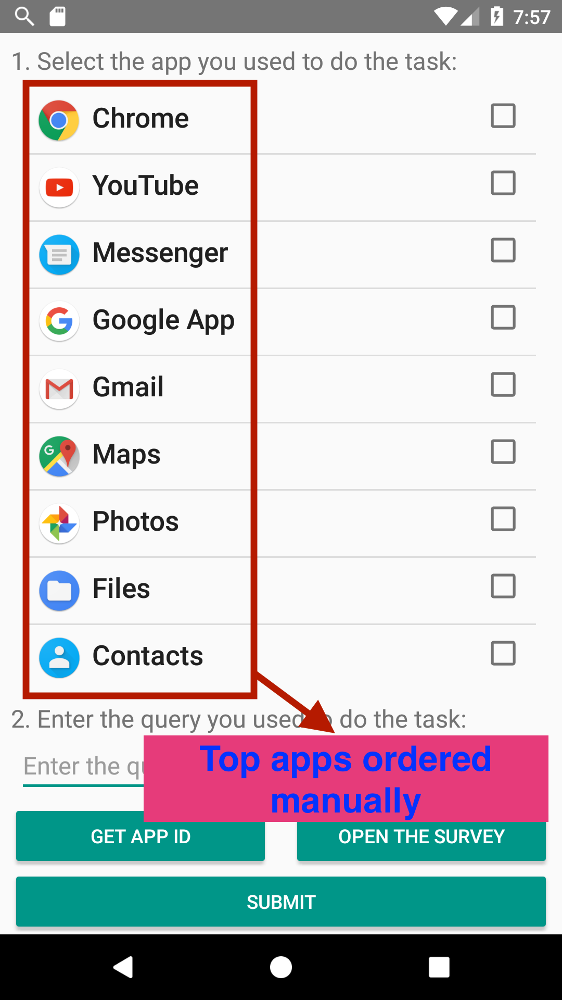
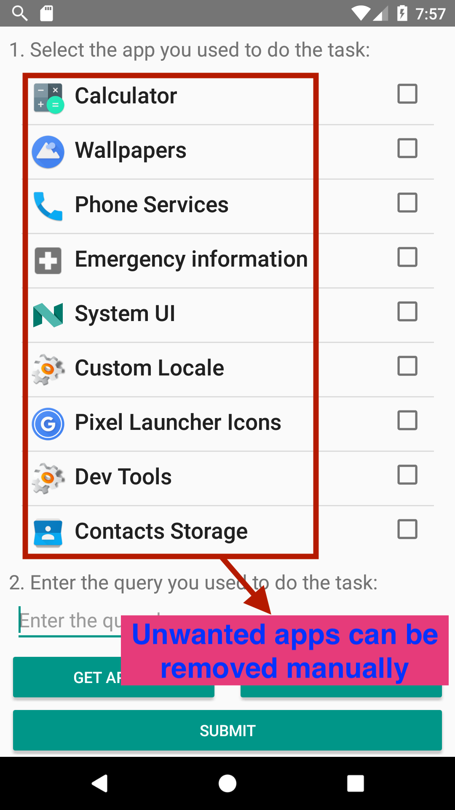

# uSearch
uSearch is an Android app aimed for research on Mobile Information Retrieval. It has been developed at the Università della Svizzera italiana (USI), Lugano, Switzerland, in collaboration with the Center for Intelligent Information Retrieval (CIIR) at the University of Massachusetts Amherst (UMass), Amherst, MA, USA.

## Requirements

This application requires a [Firebase account](https://firebase.google.com/) to work.

An account for Crashanalytics is required for Crash Analytics reporting

Qualtrics is used for the survey. The link for the questionnaires are in MainActivity (openSurvey).
TaskBrowserActivity uses an interceptor to know when the user has finished a questionnaire, the url that Qualtrics uses might change in the future. 

## Usage

This application can be used for task-based or self-report user studies in cross-app mobile search research. We have used uSearch to collect a cross-app query log (data available here: [ISTAS](https://github.com/aliannejadi/istas))
 
Sensors data from participants' smartphones are collected for the duration of a study. The collected data
is routinely uploaded to the cloud (Firebase Storage) for easy access and analysis.

## Quick Start

In order to run uSearch, follow the steps below:

1. Change the project's package name. To do so, follow [this useful post](https://stackoverflow.com/questions/16804093/android-studio-rename-package) on Stackoverflow.
2. Create a new project on Firebase and add the new package name in your project. Note that uSearch uses Firebase "Storage" service.
3. Create a new bucket on Firebase Storage.
4. Download "google-services.json" file and add it to the project under: uSearch/app/src
5. Configure the app to connect to your Fabric account.
6. The app's survey data is available only to the authors, therefore you should update its link to your own survey. The code can be found in MainActivity in "openSurvey" method.
7. Build your first APK file! 

## Enable/Disable Sensors

To enable/disable the collection of a sensor the 2 classes to edit are RecordStorageManager and BackgroundRecorder.

* RecordStorageManager.java (edit this to enable/disable the upload)

Add the constant of the sensor to the array
 
__filesNamesList__

If the data need to be uploaded when only mobile data are available add it also to 

__lightFilesNamesList__

To stop the upload of a sensor remove it from both arrays. 

* BackgroundRecorder.java (edit this to enable/disable the gathering)

To enable the gathering of a sensor, reach the definition of the runnable __s__ and uncomment the function related to the sensor. 
To disable simply comment the function of the sensor.

## Modify Sensor/Data Sample Rate

For the majority of the data that uSearch collects, data is collected based on interrupts. However, some of the sensor data such as GPS are still based on polling. Moreover, the data is written to the memory of the phone at a certain rate to clean the phone's RAM. All these rates can be modified in the class named __BackgroundRecorder__. Below you can find pointers to where you can modify sampling rate of the app:

```java 
    // app usage interval period in milliseconds
    private final long USAGE_INTERVAL = 1000 * 60 * 60 * 24;
```
```java
    // the sample rate for location recording
    private long locationRate = 1000 * 60 * 2;
```
```java
    // the sample rate in milliseconds
    private long sampleRate = 1000 * 60 * 2;

    // the runnable that will be called each sampleRate milliseconds
    private final Runnable s = new Runnable() {

        @Override
        public void run() {

            if (keepStalking) {

                Log.i(RRUN, "recording data");
                recordWLAN();
                recordCell();
                recordAccelerometer();
                recordGyroscope();
                recordLight();
                recordBattery();
                recordScreen();

            }

            h.postDelayed(this, sampleRate);

        }

    };
 ```
 ```java
     // the recording submission rate
    private final long recordRate = 1000 * 60 * 60 * 1;

    // the runnable that is in charge of submitting the records to Firebase Storage
    private final Runnable r = new Runnable() {

        @Override
        public void run() {
        rsm.uploadRecords(getApplicationContext());
        h.postDelayed(this, recordRate);

        }

    };
 ```

## Data Format

All the sensor, interaction, and input data are stored in JSON files and pushed to a Firebase storage bucket. The sampled data are stored in one file per each data type (e.g., location data, battery data, etc.). At every "recordRate", the available data batch is stored in a single file named ```[record type]_records_[timestamp].json```. For example, the location data at timestamp 1539284954 will be stored in a JSON file named ```location_records_1539284954.json```. Every such file is stored under a directory named ```user + [user id]```, where ```user id``` is the phone's unique ID.
Below is an example JSON file for battery records:
```json
{"health":"good","level":23,"plugged":"?","scale":100,"status":"discharging","temperature":333,"timestamp":1523766100661,"voltage":3692
{"health":"good","level":22,"plugged":"?","scale":100,"status":"discharging","temperature":345,"timestamp":1523766220734,"voltage":3666}
```

## Update the Order/Presence of Apps

As the list of apps is different on every device based on the version and build, one may need to define certain apps to appear higher in the app list. Also, certain apps may be system apps and not needed in the list.

The app reads two lists from the raw resource directory: 
* apps_order.csv : top apps are ordered in this list by their name to appear as indicated in the list.
* apps_blacklist.csv : unwanted apps are listed here to be removed from the list.

Below you can see an example of top apps that are ordered as indicated in apps_order.csv as well as some unwanted apps that may appear in the list of apps.

  

Please note that apps that do not appear in either of the lists are listed after the "top apps" in the order of Android's package manager.

## Acknowledgements

The design and development of uSearch was in part supported by the RelMobIR project of Swiss National Science Foundation (SNSF) and in part by the UROP grant, provided by the Università della Svizzera italiana (USI). We would like to thank Jacopo Fidacaro and Luca Costa for their efforts in developing this app. Last but not least, we would like to thank all the participants who helped us improve the app and collect data.

## Contact

Please do feel free to contact us for any questions.
* Mohammad Aliannejadi: mohammad.alian.nejadi@usi.ch

## Citation

Please cite our CIKM '18 paper if you use uSearch or its components:

    @inproceedings{AliannejadiCikm18,
        author    = {Aliannejadi, Mohammad and Zamani, Hamed and Crestani, Fabio and Croft, W. Bruce},
        title     = {In Situ and Context-Aware Target Apps Selection  for Unified Mobile Search},
        booktitle = {Proceedings of the 27th {ACM} International Conference on
             Information and Knowledge Management},
        series    = {{CIKM '18}},
        pages     = {1383--1392},
        location  = {Torino, Italy},          
        year      = {2018}
      }
